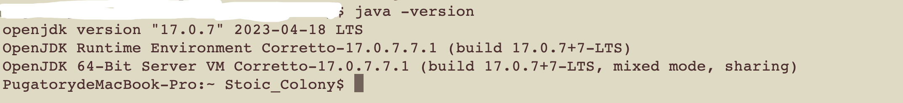

<!-- Improved compatibility of back to top link: See: https://github.com/othneildrew/Best-README-Template/pull/73 -->
<a id="readme-top"></a>
<!--
*** Thanks for checking out the Best-README-Template. If you have a suggestion
*** that would make this better, please fork the repo and create a pull request
*** or simply open an issue with the tag "enhancement".
*** Don't forget to give the project a star!
*** Thanks again! Now go create something AMAZING! :D
-->


<!-- PROJECT SHIELDS -->
<!--
*** I'm using markdown "reference style" links for readability.
*** Reference links are enclosed in brackets [ ] instead of parentheses ( ).
*** See the bottom of this document for the declaration of the reference variables
*** for contributors-url, forks-url, etc. This is an optional, concise syntax you may use.
*** https://www.markdownguide.org/basic-syntax/#reference-style-links
-->

[//]: # ([![Contributors][contributors-shield]][contributors-url])

[//]: # ([![Forks][forks-shield]][forks-url])

[//]: # ([![Stargazers][stars-shield]][stars-url])

[//]: # ([![Issues][issues-shield]][issues-url])

[//]: # ([![MIT License][license-shield]][license-url])

[//]: # ([![LinkedIn][linkedin-shield]][linkedin-url])


<!-- PROJECT LOGO -->
<br />
<div align="center">

[//]: # (  <a href="https://github.com/othneildrew/Best-README-Template">)

[//]: # (    )

[//]: # (  </a>)

  <h3 align="center">Employee Management System</h3>

  <p align="center">
    A solution for employee management
    <br />

[//]: # (    <a href="https://github.com/othneildrew/Best-README-Template"><strong>Explore the docs »</strong></a>)

[//]: # (    <br />)

[//]: # (    <br />)

[//]: # (    <a href="https://github.com/othneildrew/Best-README-Template">View Demo</a>)

[//]: # (    ·)

[//]: # (    <a href="https://github.com/othneildrew/Best-README-Template/issues">Report Bug</a>)

[//]: # (    ·)

[//]: # (    <a href="https://github.com/othneildrew/Best-README-Template/issues">Request Feature</a>)
  </p>
</div>


<!-- TABLE OF CONTENTS -->
<details>
  <summary>Table of Contents</summary>
  <ol>
    <li>
      <a href="#project-prerequisite">Project Prerequisite</a>
      <ul>
        <li><a href="#setup-java-environment">Setup Java Environment</a></li>
        <li><a href="#setup-node-environment">Setup Node Environment</a></li>
        <li><a href="#setup-gradle-environment">Setup Gradle Environment</a></li>
      </ul>
    </li>
    <li>
      <a href="#built-with">Built with</a>
    </li>
    <li>
      <a href="#getting-start">Getting Start</a>
      <ul>
        <li><a href="#start-database">Start Database</a></li>
        <li><a href="#setup-environment-variables">Setup Environment Variables</a></li>
        <li><a href="#start-application">Start Application</a></li>
      </ul>
    </li>
    <li><a href="#roadmap">Roadmap</a></li>
    <li><a href="#contributing">Contributing</a></li>
    <li><a href="#license">License</a></li>
    <li><a href="#contact">Contact</a></li>
    <li><a href="#acknowledgments">Acknowledgments</a></li>
  </ol>
</details>


<!-- ABOUT THE PROJECT -->

## Project Prerequisite

### Setup Java Environment
MacOS: https://www.oracle.com/webfolder/technetwork/tutorials/oraclecode/mac-hol-setup.pdf

Windows: https://docs.oracle.com/en/java/javase/11/install/installation-jdk-microsoft-windows-platforms.html

After the Java setup, please use below command to verify


* Please use Java version greater or equal to 8

### Setup Node Environment
MacOS: https://nodejs.org/en/download

Windows: https://nodejs.org/en/download

After the Node setup, please use below command to verify (it should install npm as well)
)

* Please use Node version greater or equal to 18.12
* Please use NPM version greater or equal to 8.19


### Setup Gradle Environment
MacOS: https://gradle.org/install/

Windows: https://gradle.org/install/

After the Gradle setup, please use below command to verify


* Please use Gradle version greater or equal to 7.6.1

<p align="right">(<a href="#readme-top">back to top</a>)</p>


## Built With

The project uses below tools to build the application
* [](https://openjdk.org/)
* [](https://gradle.org/)
* [](https://www.npmjs.com/)
* [](https://nodejs.org/)

<p align="right">(<a href="#readme-top">back to top</a>)</p>


<!-- GETTING STARTED -->
## Getting Start

This is an example of how you may give instructions on setting up your project locally.
To get a local copy up and running follow these simple example steps.

### Start Database
Please use ***configuration/database/ems-ddl.sql*** to build the database.

After the database started, please check the database connection.
  ```sh
  mysql -u root -p emsdb -p
  show tables
  ```


### Setup Environment Variables
The project need some credentials to start

Please set up your database username and password as below
   ```sh
   EMSDB_USERNAME=*******
   EMSDB_PASSWORD=*******
   ```

<p align="right">(<a href="#readme-top">back to top</a>)</p>


<!-- USAGE EXAMPLES -->
## Start Application

Please use below command to build the project in the project root folder
   ```sh
   gradlew run_project 
   ```
If you have editor, you can use the integrated command directly


<p align="right">(<a href="#readme-top">back to top</a>)</p>


<!-- ROADMAP -->
## Roadmap

- [x] Add Changelog
- [x] Add back to top links
- [ ] Add Additional Templates w/ Examples
- [ ] Add "components" document to easily copy & paste sections of the readme
- [ ] Multi-language Support
    - [ ] Chinese
    - [ ] Spanish

See the [open issues](https://github.com/othneildrew/Best-README-Template/issues) for a full list of proposed features (and known issues).

<p align="right">(<a href="#readme-top">back to top</a>)</p>


<!-- CONTRIBUTING -->
## Contributing

Contributions are what make the open source community such an amazing place to learn, inspire, and create. Any contributions you make are **greatly appreciated**.

If you have a suggestion that would make this better, please fork the repo and create a pull request. You can also simply open an issue with the tag "enhancement".
Don't forget to give the project a star! Thanks again!

1. Fork the Project
2. Create your Feature Branch (`git checkout -b feature/AmazingFeature`)
3. Commit your Changes (`git commit -m 'Add some AmazingFeature'`)
4. Push to the Branch (`git push origin feature/AmazingFeature`)
5. Open a Pull Request

<p align="right">(<a href="#readme-top">back to top</a>)</p>


<!-- LICENSE -->
## License

Distributed under the MIT License. See `LICENSE.txt` for more information.

<p align="right">(<a href="#readme-top">back to top</a>)</p>


<!-- CONTACT -->
## Contact

Your Name - [@your_twitter](https://twitter.com/your_username) - email@example.com

Project Link: [https://github.com/your_username/repo_name](https://github.com/your_username/repo_name)

<p align="right">(<a href="#readme-top">back to top</a>)</p>


<!-- ACKNOWLEDGMENTS -->
## Acknowledgments

Use this space to list resources you find helpful and would like to give credit to. I've included a few of my favorites to kick things off!

* [Choose an Open Source License](https://choosealicense.com)
* [GitHub Emoji Cheat Sheet](https://www.webpagefx.com/tools/emoji-cheat-sheet)
* [Malven's Flexbox Cheatsheet](https://flexbox.malven.co/)
* [Malven's Grid Cheatsheet](https://grid.malven.co/)
* [Img Shields](https://shields.io)
* [GitHub Pages](https://pages.github.com)
* [Font Awesome](https://fontawesome.com)
* [React Icons](https://react-icons.github.io/react-icons/search)

<p align="right">(<a href="#readme-top">back to top</a>)</p>
